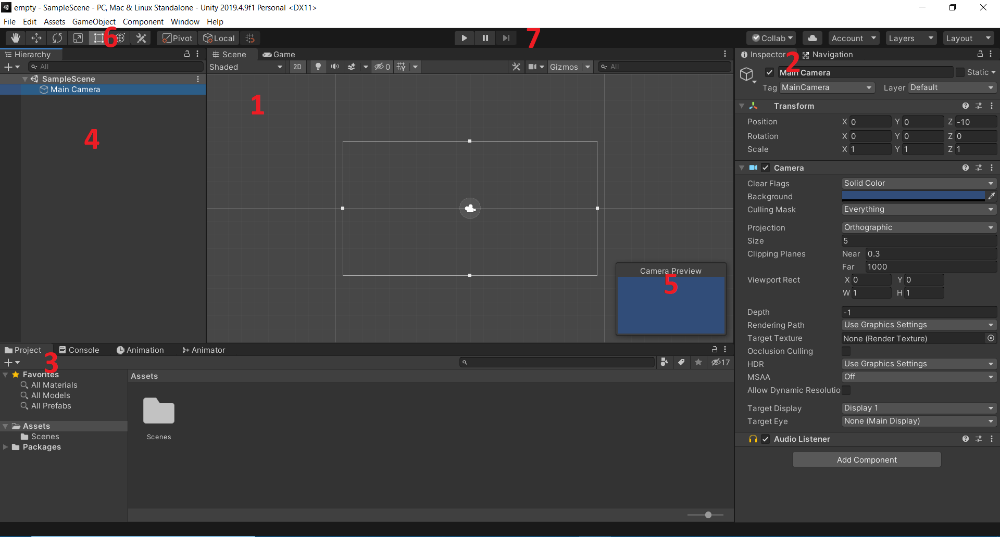
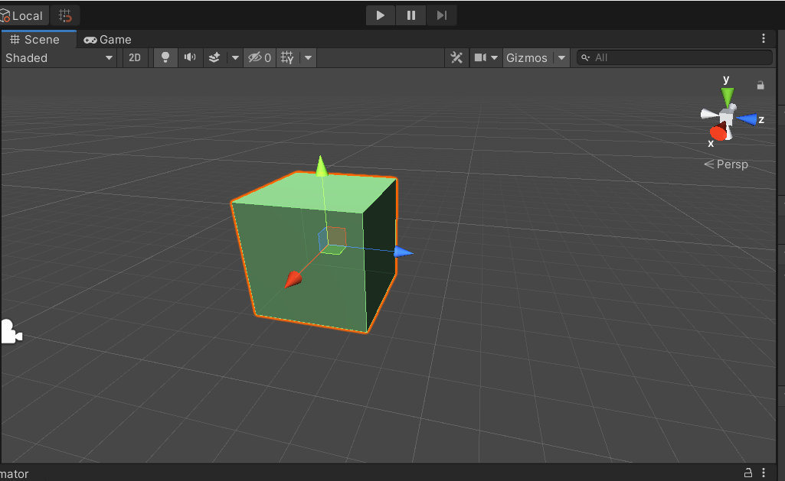
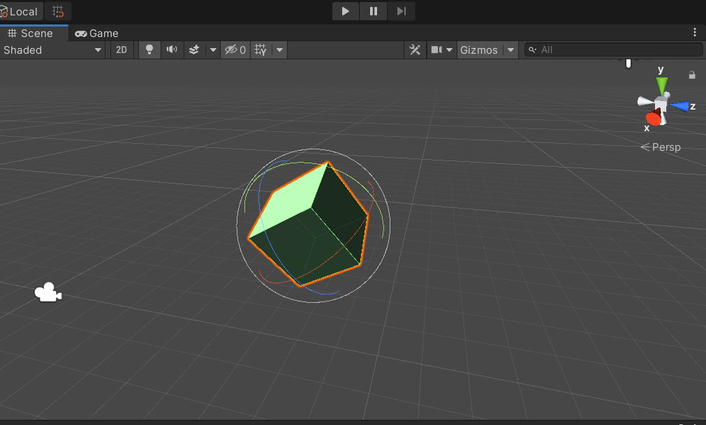
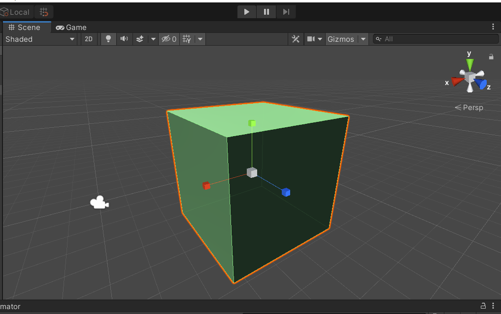
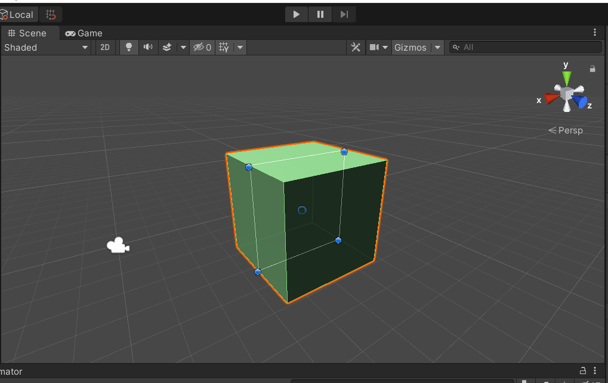
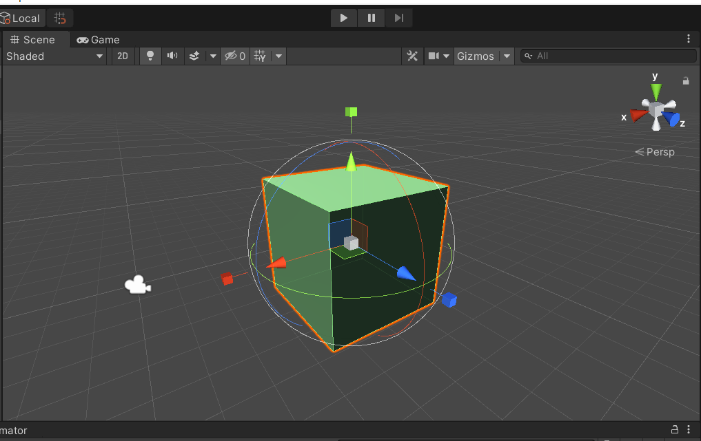

# Lab 1 - Podstawy obsługi środowiska UnityEditor

## *Interfejs UnityEditor*
   
   

### **1. SceneView**

Ten widok to nasza przestrzeń robocza z widokiem na aktualnie aktywną scenę (gra może ich posiadać wiele). Tutaj możemy dodać, edytować, usuwać obiekty gry (GameObject). Tymi obiektami mogą być modele 2D i 3D, kamery, oświetlenie itp.. W momencie kiedy uruchomimy grę (na razie w UnityEditor) możemy również w czasie rzeczywistym dokonywać pewnych zmian na scenie i podglądać zmiany w grze w czasie rzeczywistym. Po zatrzymaniu gry widok sceny wróci do punktu początkowego a wprowadzone zmiany nie zostaną zapisane (można jednak temu zaradzić).

### **2. Inspector Window**

Jest to okno, które prezentuje wszystkie cechy zaznaczonego obiektu gry oraz komponenty, które zostały do niego podpięte. Tutaj możemy modyfikować widoczne parametry komponentów (również gdy wciśniemy "Play"), dodawać lub usuwać komponenty do obiektu. 

### **3. Project Window**

Jest to widok, który prezentuje zawartość projektu. Możemy tutaj dodawać nowe foldery i organizować elementy gry wokół nich. Z tego miejsca możemy poprzez przeciąganie dodawać obiekty albo bezpośrednio na scenę lub do okna hierarchii. 

Można również przeciągać zasoby spoza UnityEditor do okna Project i w takim przypadku Unity zaimportuje te elementy jako nowe zasoby projektu.

Mimo, że w oknie Project widzimy odbicie struktury zasobów naszego projektu jak w systemie plików, to Unity zarządza tymi zasobami również poprzez metainformacje, które mogą zostać uszkodzone (niespójność) jeżeli w tej hierachii dokonamy zmian przez system plików a nie okno Project. Nie należy tego robić.

### **4. Hierarchy window**

To onko prezentuje wszystkie obiekty jakie są aktualnie umieszczone w naszej grze. Nazwa okna nawiązuje również do sposobu w jaki ta lista jest zaprezentowana - możemy zobaczyć które obiekty są obiektami nadrzędnymi i podrzędnymi. 

### **5. Widok kamery**

Na powyższym zrzucie ekranu aktywnym obiektem jest domyślnie umieszczana kamera w każdej nowej scenie. Zmiana parametrów kamery będzie wpływała na to co w tym oknie widać, co pozwala na ustawienie optymalnej pozycji. Podobnie będzie wyglądał również widok z podglądem na okno gry.

### **6. Toolbar**

Jest to pasek narzędziowy, który pozwala na proste przekształcenia obiektów widocznych na scenie. 

#### **6.1 Hand tool**

To narzędzie ma kilka trybów działania. Po wybraniu narzędzia i przytrzymaniu **lewego klawisza** myszy możemy zmieniać perspektywę widoku sceny.

Wciśnięcie i przytrzymanie prawego klawisza pozwala na wykonywanie obrotu widoku wokół aktualnego punktu w każdej płaszczyźnie.

Klawiszami, które pozwalają na zmianę trybu pracy tego narzędzia są również **Ctrl** oraz **Alt**. Sprawdź ich działanie w połączeniu z wciśniętym lewym lub prawym klawiszem myszy.
Sprawdź również działanie wciśniętego prawego klawisza myszy oraz klawiszy **"WASD"**.
Jeżeli prędkość przesuwania widoku sceny nas nie zadowala możemy to przyspieszyć trzymając wciśnięty klawisz **Shift**.

Istnieje też możliwość przywołania narzędzia Hand "na chwilę" poprzez wciśnięcie i przytrzymanie kółka myszy, możemy przesunąć widok a po zwolnieniu przycisku powrócimy do wcześniej aktywnego narzędzia.

``
Skrót, którym przywołamy narzędzie Hand to "Q".
``

#### **6.2 Move tool (wcześniej Translate tool)**

To narzędzie pozwala nam na przemieszczanie obiektów na scenie za pomocą myszy i klawiatury. Takie przesunięcia możemy wykonywać w jednej z trzech płaszczyzn (nawet jeżeli pracujemy nad grą 2D).

Oś x to czerwona strzałka, oś y to zielona a oś z to strzałka niebieska. Powinnismy to zapamiętać, gdyż zdarza się pracować z obiektami w różnych perspektywach, ale kolory dla osi są stałe co zapobiega "pogubieniu" się w przestrzeni, co na początku przygody z projektowaniem w 3D nie jest wcale takie trudne.

W języku UNITY zbiór tych trzech strzałek (ale nie tylko ich) nosi nazwę **gizmo**, który można przetłumaczyć na język polski jako gadżet, ale jednak oryginalna nazwa używana jest częściej. Gizmo to trójwymiarowy obiekt lub tekstura, która dostarcza informacji o jakimś elemencie typu GameObject - przydaje się szczególnie, jeżeli mamy w naszym projekcie niewidzialne obiekty, ale chcemy w trakcie projektowania gry widzieć gdzie się znajdują (np. znaczniki zakresu poruszania się platform, stworzeń, przeszkód itp.)

Przytrzymując wciśniętą strzałkę możemy przemieszczać obiekt w wybranej płaszczyźnie. Jeżeli klikniemy na kolorową płaszczyznę widoczną u zbiegu strzałek, możemy przemieszczać obiekt w dwóch wybranych płaszczyznach. Do bardziej precycyjnego pozycjonowania obiektów przyda się jednak okno inspektora.

``
Skrót, którym przywołamy narzędzie Move to "W".
``

#### **6.3 Rotate tool**

Jak sama nazwa wskazuje narzędzie to służy do obracania obiektów w przestrzeni lub wybranej płaszczyźnie. Przytrzymanie wciśniętego lewego klawisza myszy pozwala na obrót wokół punktu obrotu w wybranej płaszczyźnie (x, y lub z) a chwycenie obszaru obiektu między tymi liniami pozwala na obrót w przestrzeni trójwymiarowej. 

W przypadku zaznaczenia kilku obiektów jednocześnie możemy za pomocą kontrolek znajdujących się po prawej stronie toolbara zmieniać sposób przekształcania obiektów. Wybranie opcji **pivot** pozwala na przekształcenie każdego obiektu indywidualnie a **center** umieszcza gizmo centralnie między zaznaczonymi obiektami i obraca je jakby stanowiły połączoną całość.

Tryb **global** pozwala na manipulowanie obiektem względem globalnych współrzędnych świata bez względu na to jak aktualnie wygląda perspektywa, z której obiekt obserwujemy. Tryb **local** dokonuje tych przekształceń względem aktualnej pozycji i obrotu obiektu. Zwróć uwagę na zmianę wartości dla każdej osi przy przemieszczaniu obiektu w obu trybach.

``
Skrót, którym przywołamy narzędzie Rotate to "E".
``

#### **6.4 Scale tool**

Narzędzie to służy do skalowania obiektu. Zamiast grotów strzałki jak w przypadku narzędzia Move każda linia osi zakończona jest sześcianem. Zasada działania i kolory są takie jak w przypadku narzędzia move. Uchwycenie centralnego sześcianu zmienia rozmiar całego obiektu.

``
Skrót, którym przywołamy narzędzie Scale to "R".
``

#### **6.5 Rect tool**

Narzędzie to służy głównie to obracania obiektów 2D, ale nadaje się również dla obiektów trójwymiarowych. Pozwala ono na przemieszczanie, skalowanie i obracanie obiektów oraz na resetowanie ich punktu obrotu (pivot point).

``
Skrót, którym przywołamy narzędzie Rect to "T".
``

#### **6.6 Transform tool**

Narzędzie to łączy w jednym narzędzia Move, Rotate i Scale.

``
Skrót, którym przywołamy narzędzie Rect to "Y".
``

Mimo, że angielskie nazwy narzędzi, a przynajmniej ich pierwsze litery, mogą kojarzyć się z innymi skrótami niż te, które są do nich przypisane to wystarczy spojrzeć na kolejność narzędzi na pasku i liter na klawiaturze i wszystko staje się jasne.

#### **6.7 Available custom editor tools**

Tutaj mogą pojawić się narzędzia specyficzne dla komponentów zaznaczonego GameObject, np. edytora obiektu BoxCollider.

### **7. Play buttons**

Te trzy przyciski pozwalają na przejście z trybu edit mode do play mode. Przejście w tryb play pozwala na uruchomienie gry z pozycji startowej aktualnej sceny i podczas tego trybu możemy testować grę lub nawet dokonywać zmian w obiektach. Te zmiany będą propagowane na widoczny ekran gry, ale **nie zostaną zapisane w stanie obiektów** i po wyjściu z trybu play wszystko wraca do stanu poprzedniego.

Trybu pauzy nie trzeba chyba tłumaczyć. Ostatni przycisk służy do przechodzenia przez stan gry klatka po klatce co pozwala na łatwiejsze wychwycenie momentu, w którym występuje jakiś problem, który trudno zidentyfikować lub do bardzo precyzyjnego ustawienia obiektów.

----
## Zadania do samodzielnego wykonania

1. Przeczytaj treść pliku [readme](../lab_00/readme.md) (możesz się też wspomóc plikiem [konfiguracja Git](../lab_00/konfiguracja_git.md)) z folderu lab_00 i zainstaluj niezbędne oprogramowanie.
2. Utwórz projekt testowy Unity i skonfiguruj narzędzie Git do pracy z tym projektem. Stwórz zdalne repozytorium (GitHub, Bitbucket, Azure DevOps) i wypchnij do niego lokalne repozytorium. Pamiętaj o przygotowaniu odpowiedniego pliku .gitignore.
3. Aby bliżej zapoznać się z dostępnymi modelami stwórz z dostępnych brył model, który będzie przypominał Stonehenge. Nie musisz używać żadnych tekstur ani dokładnych modeli - tylko to co można zrobić w edytorze Unity. Podziel się efektem swojej pracy w postaci screenu na kanale spotkania.
4. Uruchom lokalny manual (jeżeli opcja instalacji dokumentacji została zaznaczona) z menu Help -> Unity manual i przeanalizuj sekcję "Working in Unity".
5. Zastanów się nad tematyką gry, którą chciałbyś stworzyć w ramach projektu zaliczeniowego. Na kolejnych zajęciach zostanie sporządzona lista projektów zaliczeniowych.
6. Jeżeli uważasz, że wiedza z zakresu znajomości języka C# wymaga odświeżenia to może warto zacząć od [Wstęp do programowania w C#](c_sharp_wer2_0.pdf). W trakcie zajeć będzie prezentowany kod w języku C#, jednak omawianie samego języka nie zostało przewidziane w programie przedmiotu.