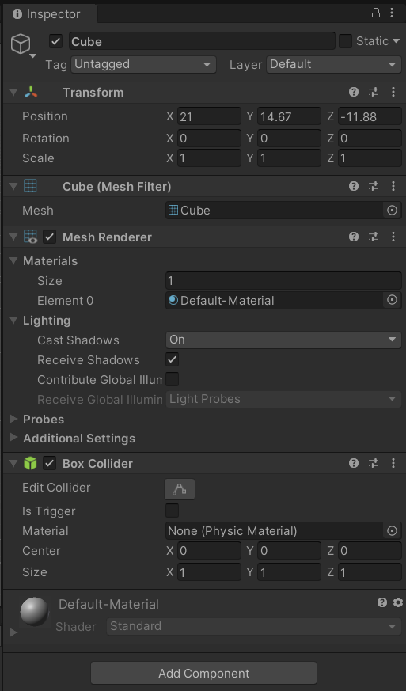
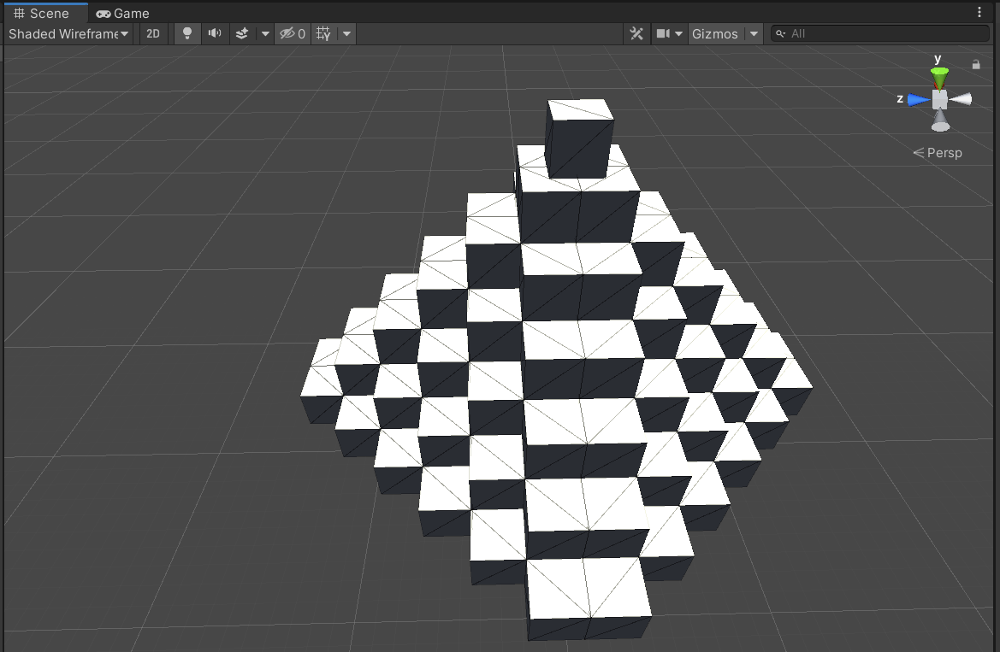
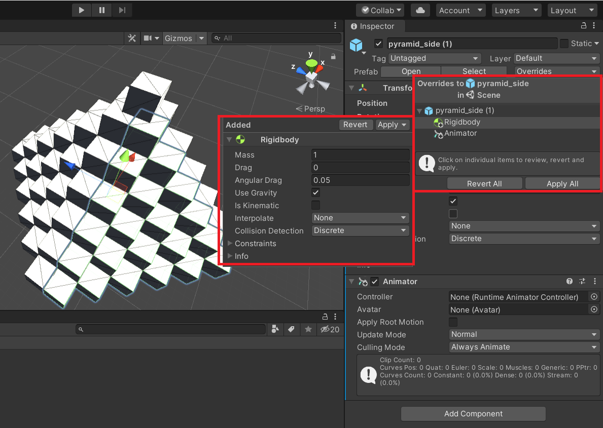

# Lab 2 - Obiekty gry, komponenty i prefabrykaty.

## 1. Obiekty gry i komponenty.

Obiekt gry (GameObject) to każdy obiekt, który pojawia się w grze, również taki, który nie jest widoczny, np. kamera, niewidzialna przeszkoda, dźwięki. Obiekty gry same w sobie nie posiadają jakiegoś zachowania i dopiero poprzez 'podpinanie' komponentów możemy nadać im pewne cechy i zachowania.

Unity posiada spory zbiór obiektów, które posiadają już dołączone komponenty, ale możemy zmieniać konfigurację zarówno samych komponentów jak i ich kombinacji.

Poniżej zaprezentowane są komponenty, które domyślnie posiada obiekt typu Cube.

### **Komponent Transform**

Podstawowym komponentem obiektu jest komponent **Transform**, który przechowuje i pozwala na modyfikację położenia, rotacji i skali danego obiektu. Każdy `GameObject` posiada komponent `Transform` i nie można go z obiektu usunąć. Można się o tym przekonać choćby wstawiając pusty obiekt na scenę.

Obiekt `Transform` przechowuje również informacje o wszystkich obiektach potomnych oraz o swoim rodzicu. Kiedy w obiekcie rodzica zostaną zmienione jakieś cechy komponentu Transform, zmianie ulegną również obiekty potomne.

Właściwości komponentu `Transform` obiektów potomnych są podawane względem obiektu rodzica. Wartości te określa się jako lokalne współrzędne. Czasami potrzeba jednak określić w jakiej pozycji globalnej znajduje się obiekt podrzędny i dlatego API Unity pozwala na konwersję lokalnych koordynatów na koordynaty globalne.

Istnieją sytuacje, w których skalowanie niejednolite (wartości dla wszystkich osi nie są równe) obiektu nadrzędnego może mieć niespodziewane konsekwencje. Więcej przeczytasz pod adresem [Non-uniform transform](https://docs.unity3d.com/2022.3/Documentation/Manual/class-Transform.html) w podrozdziale "Limitations with Non-Uniform Scaling".

Dobrą praktyką jest ustawienie obiektu rodzica w pozycji (0,0,0) przed dodaniem potomków co spowoduje ustawianie pozycji potomków również na wartość (0,0,0) - pamiętajmy, że jako lokalne koordynaty.

### **Komponent Mesh Filter**

Jest to komponent, który pobiera siatkę z zasobów (ang. assets) i przekazuje do komponentu Mesh Renderer.

### **Komponent Mesh Renderer**

Ten komponent odpowiada za wyświetlenie przekazanej przez Mesh Filter siatki i wyświetla obiekt w pozycji określownej przez komponent `Transform`. Ten komponent pozwala na wybór materiału, którym ma być pokryta siatka, tego czy przedmiot rzuca cień, czy na obiekt może padać cień oraz kilka innych ustawień związanych z oświetleniem (więcej: [Mesh Renderer](https://docs.unity3d.com/2022.3/Documentation/Manual/class-MeshRenderer.html*)).

### **Komponent Box Collider**

Ten komponent jest komponentem używanym przez system fizyki silnika Unity i odpowiada za określenie kształt kolidera (ang. collider) dla danego obiektu.
Dzięki temu komponentowi możliwe jest wykrywanie kolizji obiektów oraz wyzwalanie (ang. trigger) zdarzeń po wykryciu kolizji.

## Zadania

1. Dodaj obiekt typu Cube na scenę i dodaj do niego komponent Rigidbody. Uruchom tryb play i sprawdź zachowanie sześcianu, zwłaszcza pozycji w osi Y.
2. Dodaj platformę do sceny, na którą może "spaść" sześcian (platforma również musi posiadać odpowiednie komponenty, aby "zderzać" się z innymi obiektami). Zmodyfikuj wielkość kolidera sześcianu tak aby nie pokrywał się z bryłą sześcianu. Sprawdź zachowanie w trybie play.
3. Dodaj więcej sześcianów z komponentem Rigidbody tak, żeby po uruchomieniu trybu play swobodnie spadały na platformę.
4. Wykorzystując elementy Cube oraz narzędzia do przemieszczania oraz przyciąganie do siatki zbuduj piramidę jak na poniższym zrzucie ekranu.
   

Więcej możesz przeczytać w oficjalnej dokumentacji Unity: [GameObjects](https://docs.unity3d.com/Manual/GameObjects.html)

## 2. Prefabrykaty.

Standardowe obiekty umieszczone na scenie są dostępne tylko na tej scenie i można je traktować jako pojedyncze instancje, chociaż możemy utworzyć i umieścić wiele kopii tych samych obiektów. Jednak kiedy zainstnieje potrzeba dokonania zmian we wszystkich kopiach możemy natrafić na pewne trudności w zarządzaniu obiektami. Powielanie ich na inne sceny rónież jest niewygodne przy takim podejściu.
Dużo lepszym pomysłem jest stworzenie prefabrykatu (szablonu), który zostanie umieszczony w zasobach projektu (assets) i możliwe jest jego wielokrotne wykorzystanie oraz edycja w jednym miejscu. Dodatkowo każda instancja (kopia) prefabrykatu jest edytowalna niezależnie (per instance) umożliwiając również nadpisanie zmienionej cechy na prefabrykat jeżeli taka będzie nasza wola.

Aby utworzyć prefabrykat dodajemy obiekt gry na scenę - i może to być dowolny obiekt. Jeżeli ma to być jakaś bryła składająca się z wielu obiektów to niezłym pomysłem jest rozpoczęcie od pustego obiektu gry (Empty GameObject) a następnie dodanie kolejnych obiektów jako potomków. Następnie przeciągamy taki obiekt do okna "Project", najlepiej do wcześniej przygotowanej struktury folderów dla prefabrykatów, i upuszczamy. Kolor obiektu w panelu `Hierarchy` powinien zmienić się na niebieski.

Teraz możemy taki prefabrykat wykorzystywać wielokrotnie. Po dodaniu komponentu lub zmianie wartości komponentu w instancji prefabrykatu możemy w oknie `Inspector` wybierając przycisk "Overrides" zdecydować czy chcemy te zmiany propagować na oryginalny prefabrykat czy może przywrócić stan aktualnej instancji do oryginalnej postaci. Możemy też decydować niezależnie dla każdej zmiany, którą wprowadziliśmy.

Opcja "Apply All" zastosuje wszystkie zmiany do bazowego prefabrykatu, "Revert All" przywróci edytowaną instancję do postaci zgodnej z jej prefabrykatem. 

Klikając prawym przyciskiem myszy w panelu `Hierarchy` na wybraną instancję prefabrykatu możemy wybrać opcję "Unpack prefab", która spowoduje wypakowanie całej hierarchii obiektów prefabrykatu i odpięcie prefabrykatu jako rodzica.

Zadania

1. Stwórz nową scenę i dodaj do niej obiekt typu Cube. Dodaj kolejny obiekt typu Cube będący potomkiem wcześniej dodanego obiektu.
2. Zmień skalę obiektu bazowego na 0.5 dla każdej osi. Czy rozmiar potomka się zmienił ? A czy właściwości scale potomka się zmieniły ? Dodaj niezależny obiekt cube o standardowej wielkości i umieść go przylegająco do obiektu potomnego na tej samej płaszczyźnie Y. Przemieść teraz obiekt potomny o 1 jednostkę do góry w osi Y. Czy przesunięcie odbyło się o 1 metr (domyślna wartość dla 1 jednostki) ?  Zrozumienie tego konceptu Unity jest istotne. 
3. Dodaj pusty obiekt do sceny, ustaw go w pozycji (0,0,0) a następnie stwórz z niego prefabrykat. Zbuduj model składający się z kilku obiektów.
4. Dodaj kilka kopii prefabrykatu do sceny. Przejdź do edycji prefabrykatu i zmień układ jego elementów. Jakie zmiany zaszły na scenie ?
5. Teraz zmień lub dodaj nowy komponent do jednej z instancji prefabrykatu i zastosuj zmiany do prefabrykatu. Sprawdź czy zmiany zostały zastosowane do innych instancjach. 
6. Dodaj kolejną instancję prefabrykatu, dokonaj zmian w modelu np. obrót, skala jednego z jego elementów (ale nie edytując prefabrykatu tylko tę instancję). Czy zmiana pozycji jednego z elementów instancji ma wpływ na inne instancje ? Czy takie zmiany można nadpisać do prefabrykatu ?
7. Przeciągnij zmodyfikowaną instancję do miejsca gdzie zapisany był poprzedni prefabrykat. Okno, które się pojawi da możliwość utworzenia wariantu prefabrykatu (ang. Prefab Variant). Poczytaj więcej pod adresem: https://docs.unity3d.com/Manual/PrefabVariants.html i stwórz nowy wariant prefabrykatu.
8. Poprzez Package Manager zainstaluj Pro Builder (tu trzeba włączyć wyświetlanie Preview packages z opcji Advanced - poprzednie wersje edytora Unity). Następnie obejrzyj https://www.youtube.com/watch?v=PUSOg5YEflM oraz https://www.youtube.com/watch?v=YtzIXCKr8Wo&t. Możesz też poszukać dokumentacji. 
9. Za pomocą narzędzia Pro Builder stwórz model wieży zamkowej na wzór tej spod adresu https://imgur.com/r/lowpoly/X1oBRy8. Zadanie polega na próbie odwzorowania kształtu a nie materiału i ustawień oświetlenia.

__Dodatkowe materiały:__  
Manual narzędzia ProBuilder można znaleźć pod adresem: https://docs.unity3d.com/Packages/com.unity.probuilder@5.1/manual/overview-ui.html

Cały rozdział poświęcony prefabrykatom: https://docs.unity3d.com/Manual/Prefabs.html

Tutorial poświęcony zagnieżdżonym prefabrykatom: https://docs.unity3d.com/Manual/NestedPrefabs.html