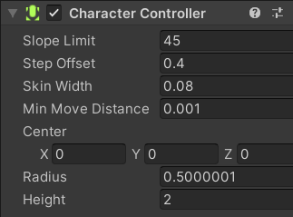
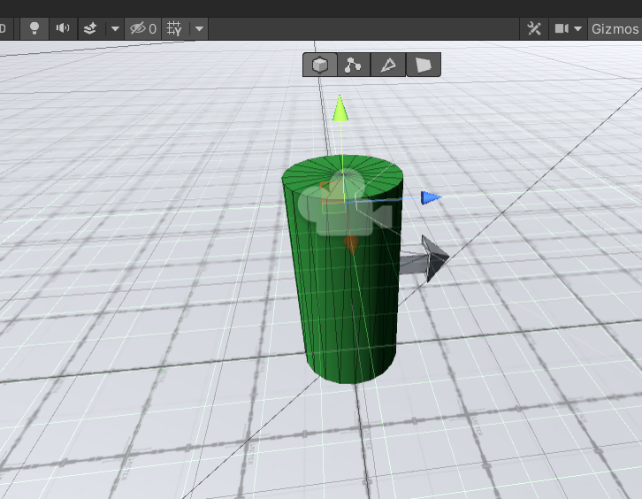

# Lab 4 - Współprogramy oraz komponent CharacterController.


## 1. Coroutine (współprogram)

Coroutine to byt zbliżony do funkcji, który posiada możliwość wstrzymania swojego wykonania, a następnie powrót do wykonania w miejscu, w którym zostało ono zakończone. W przypadku Unity tym punktem będzie klatka animacji. Aby zrozumieć lepiej ten koncept prześledź przykład poniżej.

W skrypcie generowane jest 10 losowych pozycji obiektu, a następnie poprzez coroutine co określony odstęp czasu (domyślnie 3 sekundy) generowany jest kolejny obiekt i umieszczany w przestrzeni. Po dodaniu ostatniego obiektu współprogram jest zatrzymywany.

> **Listing 1**
```csharp
using System;
using System.Collections;
using System.Collections.Generic;
using System.Linq;
using UnityEngine;

public class RandomCubesGenerator : MonoBehaviour
{
    List<Vector3> positions = new List<Vector3>();
    public float delay = 3.0f;
    int objectCounter = 0;
    // obiekt do generowania
    public GameObject block;

    void Start()
    {
        // w momecie uruchomienia generuje 10 kostek w losowych miejscach
        List<int> pozycje_x = new List<int>(Enumerable.Range(0, 20).OrderBy(x => Guid.NewGuid()).Take(10));
        List<int> pozycje_z = new List<int>(Enumerable.Range(0, 20).OrderBy(x => Guid.NewGuid()).Take(10));
        
        for(int i=0; i<10; i++)
        {
            this.positions.Add(new Vector3(pozycje_x[i], 5, pozycje_z[i]));
        }
        foreach(Vector3 elem in positions){
            Debug.Log(elem);
        }
        // uruchamiamy coroutine
        StartCoroutine(GenerujObiekt());
    }

    void Update()
    {
        
    }

    IEnumerator GenerujObiekt()
    {
        Debug.Log("wywołano coroutine");
        foreach(Vector3 pos in positions)
        {
            Instantiate(this.block, this.positions.ElementAt(this.objectCounter++), Quaternion.identity);
            yield return new WaitForSeconds(this.delay);
        }
        // zatrzymujemy coroutine
        StopCoroutine(GenerujObiekt());
    }
}

```
W powyższym przykładzie zastosowana została funkcja ```WaitForSeconds()```, którą poprzedza zapis ```yield return```. To właśnie w momencie tego wywołania coroutine zostaje wstrzymana i od tego miejsca później wznowiona. Dzięki tej funkcji możemy również wywoływać kod częściej niż raz na klatkę. Domyślnie współprogram jest wznawiany w kolejnej ramce animacji jeżeli umieścimy w niej kod ```yield return null```, co pozwala na synchroniczną pracę współprogramów wraz z kolejnym wywołaniem funkcji ```Update()```.

Przykład z manuala Unity pokazuje jak zsynchronizować zmianę właściwości koloru z kolejnym wywołaniem klatek animacji. W standardowej funkcji cały kod w niej zawarty zostałby wykonany w całości (atomowo) i tylko raz. Oczywiście moglibyśmy umieścić kod w funkcji ```Update()``` i monitorować upływający czas lub ilość klatek, które zostały wygenerowane od rozpoczęcia wywołania funkcji.

> **Listing 2**
```csharp
IEnumerator Fade() 
{
    for (float ft = 1f; ft >= 0; ft -= 0.1f) 
    {
        Color c = renderer.material.color;
        c.a = ft;
        renderer.material.color = c;
        yield return null;
    }
}
```

Więcej o coroutines można przeczytać pod adresem  https://docs.unity3d.com/2022.3/Documentation/Manual/Coroutines.html.
W Internecie można również natkąć się na wiele negatywnych komentarzy na temat współprogramów i powodu, dla którego pojawiają się w Unity (brak await/async w momencie kiedy rozpoczęto prace nad silnikiem Unity). Skoro jednak ich obecność w API Unity jest zaznaczona w dokumentacji oraz na schemacie przepływu (patrz link poniżej), ich użycie wydaje się więc wolnym wyborem dewelopera.

> W manualu Unity znajduje się bardzo przydatny schemat kolejności wywołań poszczególnych zdarzeń silnika Unity, którego poznanie znacznie ułatwia podjęcie decyzji gdzie umieścić dany fragment kodu. Link: https://docs.unity3d.com/2022.3/Documentation/Manual/ExecutionOrder.html


## 2. Komponent [CharacterController](https://docs.unity3d.com/2022.3/Documentation/ScriptReference/CharacterController.html)

Jest to komponent, który możemy wykorzystać aby obsłużyć ruch obiektu w świecie Unity z już zaimplementowanymi pewnymi funkcjami i założeniami, które często musimy dla poruszającej się postaci zakodować. Komponent ten służy do poruszania obiektami bez wykorzystania komponentu Rigidbody ale z uwzględnieniem wszelkich colliderów. Komponent ten posiada dołączony collider w postaci kapsuły o wysokości 2 (co oddaje mniej więcej wielkość postaci ludzkiej) i promieniu 0.5. Te parametry można zmienić poprzez okno inspektora lub z poziomu skryptu.

  
Do komponentu dodano również kilka modyfikowalnych właściwości:
* **Slope limit** - maksymalny kąt nachylenia jaki poruszający się obiekt jest w stanie pokonać,
* **Step Offset** - maksymalna wysokość schodka od podłoża (na którym aktualnie znajduje się poruszany obiekt) jaką można pokonać,
* **Skin Width** - wielkość jaką collidery (postaci i inny, który jest akurat w stanie kolizji z postacią) mogą penetrować swoje granice. Zbyt niskie wartości mogą powodować, że postać będzie "utykać" przy zderzeniach z niektórymi coliderami.
* **Min Move Distance** - minimalny dystans o jaki będzie się przemieszczał obiekt, jeżeli wartość przemieszczenia jest mniejsza, obiekt nie wykona ruchu. Może to zapobiegać efektowi drgania postaci.

Na obiekt kontrolowany przez ten komponent nie działają siły fizyczne i obiekt nie będzie też działał na inne obiekty np. odpychając je. Można jednak dodać takie zachowanie poprzez implementację w metodzie ```OnControllerColliderHit()```

W [manualu](https://docs.unity3d.com/2022.3/Documentation/Manual/class-CharacterController.html) można znaleźć kilka wskazówek jak dostosować parametry komponentu do własnych potrzeb.

Podpięcie tego komponentu nie oznacza, że nasza postać (obiekt) będzie od razu sie poruszał poprzez wykorzystanie domyślnych kontrolerów. Musimy to samodzielnie zaprogramować. Ruch odbywa się poprzez wywołanie funkcji ```Move()``` i przekazanie obiektu ```Vector3``` jako argumentu określającego kolejną pozycję.


**Zadanie 1**  
Wykorzystaj kod z ```listingu 1``` i zmodyfikuj go tak, aby możliwe było:
* określenie w inspektorze ilości obiektów losowych do wegenerowania,
* pozycje ```x``` oraz ```z``` były pobierane adekwatnie dla obiektu platformy, do której skrypt jest dołączany (zakładamy, że tak będzie),
> Wskazówka: https://docs.unity3d.com/2022.3/Documentation/ScriptReference/Bounds.html
* dodaj do swojego projektu nowe materiały, tak, aby było 5 różnych do wykorzystania i przydzielaj losowo materiał w trakcie tworzenia nowego obiektu.

**Zadanie 2**  
Stwórz nową scenę i zbuduj w niej testowy poziom wykorzystując ProBuilder. Stwórz podejścia o różnym kącie nachylenia, schody i ściany. Dodaj dowolny model postaci (może to być dość prosta bryła) i wykorzystaj przykładową implementację ruchu z wykorzystaniem ```CharacterController``` z dokumentacji Unity ([tu](https://docs.unity3d.com/ScriptReference/2022.3/Documentation/CharacterController.Move.html)). Przetestuj poziom (aktualnie ustawiając kamerę tak, żeby obejmowała cały poziom) i ewentualnie dostosuj parametry komponentu jeżeli nie można pokonać niektórych przeszkód (wzniesienia, schody).

**Zadanie 3**  
Podepnij kamerę pod postać tak aby była jego obiektem potomnym i ponownie sprawdź działanie programu. Może to być widok FPP lub TPP.

## 3. Wykorzystanie komponentu CharacterController w grze typu FPS

Wykorzystanie przykładowej implementacji nie daje dobrych efektów. Poniżej oryginalna (prawie) postać przykładowego kodu wykorzystania funkcji ```CharacterController.Move()```.

> **Listing 3**  
```csharp
using System.Collections;
using System.Collections.Generic;
using UnityEngine;

public class MoveWithCharacterController : MonoBehaviour
{
    private CharacterController controller;
    private Vector3 playerVelocity;
    private bool groundedPlayer;
    private float playerSpeed = 2.0f;
    private float jumpHeight = 1.0f;
    private float gravityValue = -9.81f;

    private void Start()
    {
        // zakładamy, że komponent CharacterController jest już podpięty pod obiekt
        controller = GetComponent<CharacterController>();
    }

    void Update()
    {
        groundedPlayer = controller.isGrounded;
        if (groundedPlayer && playerVelocity.y < 0)
        {
            playerVelocity.y = 0f;
        }

        Vector3 move = new Vector3(Input.GetAxis("Horizontal"), 0, Input.GetAxis("Vertical"));
        controller.Move(move * Time.deltaTime * playerSpeed);

        if (move != Vector3.zero)
        {
            gameObject.transform.forward = move;
        }

        // zmienia wysokość postaci.
        if (Input.GetButtonDown("Jump") && groundedPlayer)
        {
            playerVelocity.y += Mathf.Sqrt(jumpHeight * -3.0f * gravityValue);
        }

        playerVelocity.y += gravityValue * Time.deltaTime;
        controller.Move(playerVelocity * Time.deltaTime);
    }
}
```
Dodajmy możliwość sterowania postacią za pomocą myszki. Mysz może poruszać się w obu osiach, ale dla obu osi implementacja będzie nieco inna. **Ruch w osi ```X``` będzie obracał obiekt wokół osi ```Y``` a ruch myszą w osi ```Y``` będzie oznaczał obracanie samej kamery, która jest do obiektu gracza podpięta jako obiekt potomny - tym razem wokół osi X**.

Kamerę powinniśmy umieścić gdzieś w okolicach "oczu" gracza lub innej postacji, ale tak, aby kamera nie była powyżej lub poniżej samej bryły gracza, co mogłoby spowodować jej przenikanie przez obiekty otoczenia. Przykładowe umieszczenie kamery na zrzucie poniżej.




Rozpocznijmy z prostym skryptem.
> **Listing 4** 

```csharp
using System.Collections;
using System.Collections.Generic;
using UnityEngine;

public class LookAround : MonoBehaviour
{
    // ruch wokół osi Y będzie wykonywany na obiekcie gracza, więc
    // potrzebna nam referencja do niego (konkretnie jego komponentu Transform)
    public Transform player;
    void Start()
    {
        // zablokowanie kursora na środku ekranu, oraz ukrycie kursora
        // aby w UnityEditor ponownie pojawił się kursor (właściwie deaktywowac kursor w trybie play)
        // wciskamy klawisz ESC
        Cursor.lockState = CursorLockMode.Locked;
    }

    // Update is called once per frame
    void Update()
    {
        // pobieramy wartości dla obu osi ruchu myszy
        float mouseXMove = Input.GetAxis("Mouse X") * Time.deltaTime;
        float mouseYMove = Input.GetAxis("Mouse Y") * Time.deltaTime;

        // wykonujemy rotację wokół osi Y
        player.Rotate(Vector3.up * mouseXMove);

        // a dla osi X obracamy kamerę
        transform.Rotate(new Vector3(mouseYMove, 0f, 0f), Space.Self);
    }
}
```

Po podpięciu skryptu pod kamerę i dodaniu referencji do naszego gracza możemy uruchomić projekt. Po wykonaniu ruchu myszą widać bardzo niewielki ruch kamery. Taka sytuacja wynika z faktu, że wartości ```Mouse X``` oraz ```Mouse Y``` zwracają wartości dość małe, zależne od szybkości z jaką przemieszcza się kursor. Jest to odległość jaką pokonał kursor w trakcie czasu wyrenderowania jednej klatki animacji. Musimy więc zwiększyć te wartości. Najbardziej optymalnym podejściem będzie ustawienie go jako modyfikowalnego parametru. Dodatkowo można zaobserwować zjawisko inwersji ruchu myszy dla osi Y. Możemy to zmienić poprzez zmianę znaku przekazywanej wartości ```Mouse Y```.


> **Listing 5 - zmodyfikowana wersja skryptu.**

```csharp
using System.Collections;
using System.Collections.Generic;
using UnityEngine;

public class LookAround : MonoBehaviour
{
    // ruch wokół osi Y będzie wykonywany na obiekcie gracza, więc
    // potrzebna nam referencja do niego (konkretnie jego komponentu Transform)
    public Transform player;

    public float sensitivity = 200f;

    void Start()
    {
        // zablokowanie kursora na środku ekranu, oraz ukrycie kursora
        Cursor.lockState = CursorLockMode.Locked;
    }

    // Update is called once per frame
    void Update()
    {
        // pobieramy wartości dla obu osi ruchu myszy
        float mouseXMove = Input.GetAxis("Mouse X") * sensitivity * Time.deltaTime;
        float mouseYMove = Input.GetAxis("Mouse Y") * sensitivity * Time.deltaTime;

        // wykonujemy rotację wokół osi Y
        player.Rotate(Vector3.up * mouseXMove);

        // a dla osi X obracamy kamerę dla lokalnych koordynatów
        // -mouseYMove aby uniknąć ofektu mouse inverse
        transform.Rotate(new Vector3(-mouseYMove, 0f, 0f), Space.Self);

    }
}
```

Powinniśmy również nadać trochę realizmu i ograniczyć obrót wokół osi X, ale to jest już przedmiotem zadania do samodzielnego wykonania. 

Poruszanie się gracza aktualnie nie działa prawidłowo, a przynajmniej nie jak w większości gier typu FPS. Czas na kilka zmian w skrypcie poruszającym naszym graczem.

> **Listing 6 - zmodyfikowana postać skryptu
```MoveWithCharacterController```**

```csharp
using System.Collections;
using System.Collections.Generic;
using UnityEngine;

public class MoveWithCharacterController : MonoBehaviour
{
    private CharacterController controller;
    private Vector3 playerVelocity;
    private bool groundedPlayer;
    private float playerSpeed = 10.0f;
    private float jumpHeight = 1.0f;
    private float gravityValue = -9.81f;

    private void Start()
    {
        // zakładamy, że komponent CharacterController jest już podpięty pod obiekt
        controller = GetComponent<CharacterController>();
    }

    void Update()
    {
        // wyciągamy wartości, aby możliwe było ich efektywniejsze wykorzystanie w funkcji
        float moveX = Input.GetAxis("Horizontal");
        float moveZ = Input.GetAxis("Vertical");

        // dzięki parametrowi playerGrounded możemy dodać zachowania, które będą
        // mogły być uruchomione dla każdego z dwóch stanów
        groundedPlayer = controller.isGrounded;
        if (groundedPlayer && playerVelocity.y < 0)
        {
            playerVelocity.y = 0f;
        }

        // zmieniamy sposób poruszania się postaci
        // Vector3 move = new Vector3(Input.GetAxis("Horizontal"), 0, Input.GetAxis("Vertical"));
        // transform.right odpowiada za ruch wzdłuż osi x (pamiętajmy, że wartości będą zarówno dodatnie
        // jak i ujemne, a punkt (0,0) jest na środku ekranu) a transform.forward za ruch wzdłóż osi z.
        Vector3 move = transform.right * moveX + transform.forward * moveZ;
        controller.Move(move * Time.deltaTime * playerSpeed);

        // to już nam potrzebne nie będzie
        //if (move != Vector3.zero)
        //{
        //    gameObject.transform.forward = move;
        //}

        if (Input.GetButtonDown("Jump") && groundedPlayer)
        {
            // wzór na siłę 
            playerVelocity.y += Mathf.Sqrt(jumpHeight * -3.0f * gravityValue);
        }

        // prędkość swobodnego opadania zgodnie ze wzorem y = (1/2 * g) * t-kwadrat 
        // okazuje się, że jest to zbyt wolne opadanie, więc zastosowano g * t-kwadrat
        playerVelocity.y += gravityValue * Time.deltaTime;
        controller.Move(playerVelocity * Time.deltaTime);
    }
}
```

**Zadanie 4**  
Dodaj do skryptu ```LookAround``` ograniczenie obracania kamery do -90 i +90 stopni góra-dół (sprawdź metodę `Mathf.Clamp` (https://docs.unity3d.com/2022.3/Documentation/ScriptReference/Mathf.Clamp.html) z API Unity).