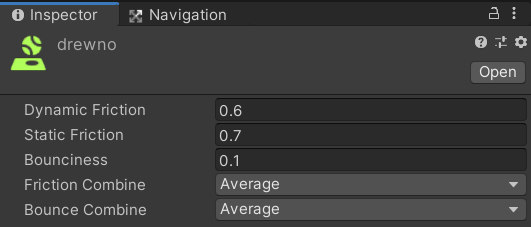

# Lab 5 - Wykrywanie i obsługa kolizji.

Wykrywanie kolizji oraz odpowiednie reagowanie na zdarzenia przez nie generowane jest jednym z głównych elementów, który daje wrażenie interakcji elementów gry między sobą często w sposób naśladujący zachowanie w świecie rzeczywistym.
Każdy kto spędził trochę czasu nad implementacją kolizji w swoim projekcie na pewno wie, że nie jest to sprawa prosta i sam silnik, nawet najlepszy, nie dostarcza wszystkich rozwiązań out of the box. W przypadku Unity, też można się szybko przekonać, że teoria a praktyka to różna para kaloszy.

## 1. Omówienie dostępnych koliderów i najważniejszych ich cech.

### 1.1 [Mesh collider](https://docs.unity3d.com/2022.3/Documentation/Manual/class-MeshCollider.html) - kolidery siatki.

Są to kolidery budowane na podstawie siatki obiektu i pozwalają na precyzyjne wykrywanie kolizji jednak z dużym obciążeniem obliczeniowym oraz z pewnymi ograniczeniami. W trybie 2D odpowiednikiem takich zderzaczy jest Polygon Collider 2D.  
Ograniczeniem jest fakt, że dwa Mesh Collidery, które się zderzają nie generują żadnego zdarzenia, co można w pewnych przypadkach obejść poprzez zaznaczenie opcji ```Convex```, która upraszcza kształt kolidera. Dodatkową zaletą jest możliwość używania wypukłego kolidera jako wyzwalacza zdarzeń kolizji. Ograniczenie to wynika z obsługi tylko wypukłych koliderów przez silnik fizyczny Unity. Zalecane jest też niemodyfikowanie kształtów takich koliderów w trakcie wykonania, gdyż ma to znaczny wpływ na spadek wydajności. W większości przypadków dużo lepszym pomysłem jest zbudowanie kolidera z prymitywnych koliderów (cube, sphere, capsule, itp.).

### 1.2 Zderzacze i Rigidbody.

Kolizje obsługiwane przez obiekty z komponentem Rigidbody są przykładem wykorzystania **koliderów dynamicznych**. Wymagają znacznie więcej mocy obliczeniowej, gdyż są przeliczane każdorazowo gdy zostanie wywołana metoda ```FixedUpdate``` (z reguły rzadziej niż ```Update```). **Statyczne kolidery** to takie, które wciąż obsługują kolizje, ale zazwyczaj nie zmieniają swojego położenia w trakcie gry. Są to obiekty bez komponentu Rigidbody.  

Kolidery z komponentem `Rigidbody` oprócz zgłaszania zdarzeń kolizji są elementami, które oddziałują i na które działają siły fizyczne. Wyjątkiem są obiekty z komponentem Rigidbody w trybie kinematycznym (```isKinematic``` z wartością ```true```), które są najczęściej "poruszane" z wykorzystaniem skryptów i nie reagują na zdarzenia fizyczne jak obiekty `Rigidbody` bez aktywnego trybu kinematycznego. Jednak takie obiekty wciąż oddziałują fizycznie na inne obiekty `Rigidbody`.

### 1.3 Materiały fizyczne. ([Physic Material](https://docs.unity3d.com/2022.3/Documentation/Manual/class-PhysicMaterial.html) oraz [Physics Material 2D](https://docs.unity3d.com/2022.3/Documentation/ScriptReference/PhysicsMaterial2D.html))

Materiały fizyczne również wpływają na obsługę kolizji dwóch obiektów. 


> Rys 1. Dostępne parametry fizycznych materiałów.

Parametry te mają wpływ na zachowanie obiektu (precyzyjniej kolidera), zarówno w stanie spoczynku (tarcie statyczne) jak i w trakcie ruchu (tarcie dynamiczne). Oprócz tarcia można również określić sprężystość, której zachowanie w przypadku kolizji dwóch koliderów wyposażonych w materiał fizyczny można dodatkowo sprecyzować parametrami ```Friction Combine``` oraz ```Bounce Combine```. Po więcej szczegółów i precyzyjny opis odsyłam do manuala: [Physic material](https://docs.unity3d.com/2022.3/Documentation/Manual/class-PhysicMaterial.html).


### 1.4 Zdarzenia wywoływane przez kolidery.

Istnieją trzy główne zdarzenia, które są zgłaszane przez kolidery.
* OnCollisionEnter([Collision](https://docs.unity3d.com/2022.3/Documentation/ScriptReference/Collision.html)) -  zgłaszane kiedy kontakt zostanie wykryty po raz pierwszy (poprzez aktualizację w silniku fizycznym), zgłaszane tylko raz,
* OnCollisionStay([Collision](https://docs.unity3d.com/2022.3/Documentation/ScriptReference/Collision.html)) - zgłaszane kiedy po wykryciu kontaktu oba kolidery wciąż pozostają w kontakcie, zgłaszane co klatkę,
* OnCollisionExit([Collision](https://docs.unity3d.com/2022.3/Documentation/ScriptReference/Collision.html)) - zgłaszane kiedy kontakt między koliderami się zakończy, zgłaszane raz.

Klasa ```Collision``` pozwala oprócz określenia kolidera, który wywołał kolizję również na wykorzystanie większej ilości szczegółów takich jak ilość punktów kontaktu, punkty kontaktu oraz prędkość zderzenia co daje dodatkowe możliwości obsługi zderzeń.

Jeżeli kolider zostanie określony jako wyzwalacz (poprzez ustawienie ```isTrigger``` na ```true```) będzie to oznaczało, że przy kontakcie innych koliderów generowane będą zdarzenia kolizji, ale obiekty nie będą blokowane przez ten kolider. Korzystanie z takiego kolidera wymaga wykorzystania poniższych metod:

* OnTriggerEnter([Collider](https://docs.unity3d.com/2022.3/Documentation/ScriptReference/Collider.html)) -  zgłaszane kiedy kontakt zostanie wykryty po raz pierwszy (poprzez aktualizację w silniku fizycznym), zgłaszane tylko raz
* OnTriggerStay([Collider](https://docs.unity3d.com/2022.3/Documentation/ScriptReference/Collider.html)) - zgłaszane kiedy po wykryciu kontaktu oba kolidery wciąż pozostają w kontakcie, zgłaszane co klatkę
* OnTriggerExit([Collider](https://docs.unity3d.com/2022.3/Documentation/ScriptReference/Collider.html)) - zgłaszane kiedy kontakt między koliderami się zakończy, zgłaszane raz.

Zwróć uwagę na zmianę argumentu tych zdarzeń - tym razem jest to klasa ```Collider```.

### 1.5 Interakcje koliderów

1. **Character controller** - ten komponent posiada wbudowany kolider w kształcie kapsuły, który został zaprezentowany w lab 4. Kolider ten "zderza" się ze statycznymi koliderami i dzięki temu może poruszać się dość sprawnie po świecie w Unity. Ten kolider może również oddziaływać na obiekty z komponentem Rigidbody, ale wymaga dodania stosownego kodu.

**_Listing 1_** - zmodyfikowana postać skryptu MoveWithCharacterController z lab 4 z wykorzystaniem fragmentu z dokumentacji (https://docs.unity3d.com/ScriptReference/2022.3/Documentation/CharacterController.OnControllerColliderHit.html)

```csharp
using System.Collections;
using System.Collections.Generic;
using UnityEngine;

public class MoveWithCharacterController : MonoBehaviour
{
    private CharacterController controller;
    private Vector3 playerVelocity;
    private bool groundedPlayer;
    private float playerSpeed = 8.0f;
    private float jumpHeight = 1.0f;
    private float gravityValue = -9.81f;
    private float pushPower = 2.0f;

    private void Start()
    {
        // zakładamy, że komponent CharacterController jest już podpięty pod obiekt
        controller = GetComponent<CharacterController>();
    }

    void Update()
    {
        float moveX = Input.GetAxis("Horizontal");
        float moveZ = Input.GetAxis("Vertical");

        groundedPlayer = controller.isGrounded;
        if (groundedPlayer && playerVelocity.y < 0)
        {
            playerVelocity.y = -2f;
        }
        
        Vector3 move = transform.right * moveX + transform.forward * moveZ;
        controller.Move(move * Time.deltaTime * playerSpeed);

        if (Input.GetButtonDown("Jump") && groundedPlayer)
        {
            playerVelocity.y += Mathf.Sqrt(jumpHeight * -3.0f * gravityValue);
        }

        // zgodnie ze wzorem y = (1/2 * g) * t-kwadrat, ale jednak w trybie play
        // okazuje się, że jest to zbyt wolne opadanie, więc zastosowano g * t-kwadrat
        playerVelocity.y += gravityValue * Time.deltaTime;
        controller.Move(playerVelocity * Time.deltaTime);
    }

    private void OnControllerColliderHit(ControllerColliderHit hit)
    {
        Rigidbody body = hit.collider.attachedRigidbody;

        // no rigidbody
        if (body == null || body.isKinematic)
        {
            return;
        }

        // We dont want to push objects below us
        if (hit.moveDirection.y < -0.3)
        {
            return;
        }

        // Calculate push direction from move direction,
        // we only push objects to the sides never up and down
        Vector3 pushDir = new Vector3(hit.moveDirection.x, 0, hit.moveDirection.z);

        // If you know how fast your character is trying to move,
        // then you can also multiply the push velocity by that.

        // Apply the push
        body.velocity = pushDir * pushPower;
    }
}
```

Przy takim zastosowaniu należy pamiętać o umieszczeniu obsługi zderzeń w odpowiednim miejscu metody `OnControllerColliderHit` w zależności czy inny kolider posiada podpięty komponent Rigidbody czy nie. Oczywiście powinniśmy unikać sytuacji, w której obsługa kolizji jest umieszczona w całości po stronie Character Controllera, dużo lepszym pomysłem jest izolowanie tego kodu w skryptach podpinanych pod inne niż gracz obiekty gry. 

2. **Kolidery statyczne**

Obiekt posiadający kolider ale bez Rigidbody, który wykrywa zderzenia z innymi koliderami również Rigidbody, ale nie oddziałują na nie siły tych zderzeń. Warto pamiętać o unikaniu przemieszczania i zmiany skali takich obiektów w czasie gry o ile to możliwe.

3. **Kolidery Rigidbody**

Najczęściej wykorzystywany komponent jeżeli chcemy minimalnym nakładem pracy wykorzystać silnik fizyczny Unity. Kolidery, które występują razem z Rigidbidy zderzają się z innymi ciałami sztywnymi oraz koliderami statycznymi.

4. **Kolidery kinematyczne Rigidbody**

Kinematyczny komponent Rigidbody wciąż może być 'sterowany' poprzez kod oddziałujący na komponent Rigidbody, ale ignorując siły fizyczne na niego działające. Taki obiekt jednak będzie oddziaływał z materiałami fizycznymi i innymi obiektami z komponentem Rigidbody. Najczęściej używa się takiej konfiguracji dla obiektów, które są przez większość czasu nieruchome, ale występuje potrzeba ich przemieszczenia dodatkowo działając siłą lub samym koliderem na inne obiekty (windy, drzwi, platformy itd.).
W praktyce można również wykorzystać możliwość dynamicznego włączania i wyłączania atrybutu ```isKinematic``` w celu aktywowania lub deaktywowania oddziaływania sił fizycznych na obiekt w trakcie gry - np. symulacja działania siły wiatru w trakcie lotu, symulacja działania wybuchu na obiekt lub innych komponentów rigidbody jeżeli zaistnieje taka potrzeba.

Aby się w tym wszystkim nie pogubić i dobrze zrozumieć kiedy jaki kolider zastosować (zwłaszcza dynamiczne) trzeba nieco wprawy i praktyki, ale warto mieć pod ręką tabelę, która zawiera informacje o interakcjach między koliderami: https://docs.unity3d.com/2022.3/Documentation/Manual/collider-types-interaction.html.


> **Wskazówka:** Stosowanie koliderów, które są mniejszych rozmiarów niż siatka obiektu w połączeniu z materiałem fizycznym pozwala na symulację zderzenia z obiektami, które wydają się miękkie, przenikalne w pewnym stopniu.

> **Wskazówka:** Ważnym aspektem jest również ustawienie parametru ```Collision Detection```, który ma wpływ na precyzję wyliczania kolizji oraz ilość cykli procesora zaangażowanych w wyliczanie kolizji. Użyj wskazówek z adresu https://docs.unity3d.com/2022.3/Documentation/Manual/class-Rigidbody.html. Zapamiętaj, że dla kinematycznych ciał sztywnych możliwe jest ustawienie wartości ```Discrete oraz Continuous Speculative```. Więcej o różnicach doczytasz [tutaj](https://docs.unity3d.com/2022.3/Documentation/Manual/ContinuousCollisionDetection.html).

### 1.6 Inne kolidery silnika Unity

Silnik Unity posiada również inne kolidery, można je nazwać koliderami specjalnego przeznaczenia. Są to [Wheel Collider](https://docs.unity3d.com/2022.3/Documentation/Manual/class-WheelCollider.html) (krótki [Tutorial](https://docs.unity3d.com/2022.3/Documentation/Manual/WheelColliderTutorial.html)) oraz [Terrain Collider](https://docs.unity3d.com/2022.3/Documentation/Manual/class-TerrainCollider.html). Nie będą one omawiane w tym laboratorium, więc lekturę pozostawiam czytelnikowi.


## 2. Przykłady obsługi kolizji.

Z tabelki kolizji wynika, że kolizje koliderów statycznych i rigidbody są rejestrowane, ale są jednak przypadki, w których się tak nie dzieje.
Wykorzystując kontroller z listingu 1 dodajemy nowy obiekt i skrypt rejestrujący kolizję z graczem.

Konfiguracja kostki, w której chcemy rejestrować zdarzenie kolizji.


> Listing 2 - Skrypt CollisionDetect.
```csharp
using System.Collections;
using System.Collections.Generic;
using UnityEngine;

public class CollisionDetect : MonoBehaviour
{
    private void OnCollisionEnter(Collision other)
    {
        if (other.gameObject.CompareTag("Player"))
        {
            Debug.Log("Player zderzył się z kostką.");
        }
    }
}

```
Uruchamiamy grę, zderzamy się z kostką i ... ewidentnie z kostką się zderzamy powodując jej przemieszczanie, ale zdarzenie po stronie kostki nie jest rejestrowane. A po stronie kontrolera ?
```csharp
...
private void OnControllerColliderHit(ControllerColliderHit hit)
    {
        if (hit.gameObject.name == "zolta_kostka")
        {
            Debug.Log("Wykryto kolizję kostki z Character Controller");
        }
        ...
    }
...
```
Character Controller ową kolizję wykrywa i możemy ją obsłużyć.

Żeby jednak nie było to wszystko takie oczywiste to nadajmy kostce jakąś prędkość, żeby pozostawała w ruchu. I usuwamy kod wykrycia kolizji z kontrolera.

```csharp
using System.Collections;
using System.Collections.Generic;
using UnityEngine;

public class CollisionDetect : MonoBehaviour
{
    private Rigidbody _rigidbody;
    void Start()
    {
        _rigidbody = this.GetComponent<Rigidbody>();
    }


    private void FixedUpdate()
    {
        _rigidbody.velocity = new Vector3(1, 0, 0);
    }

    private void OnCollisionEnter(Collision other)
    {
        if (other.gameObject.CompareTag("Player"))
        {
            Debug.Log("Player zderzył się z kostką.");
        }
    }
}

```

Teraz w przypadku zderzenia gracza z kostką czasami będą się pojawiały komunikaty o wykryciu zderzenia, ale tylko jeżeli zderzamy się z kierunku zgodnego z ruchem kostki, ale przeciwnym zwrocie. Lawirowanie w dokumentacji i próba znalezienia dokładnego wytłumaczenia nie jest prosta, ale ta sytuacja związana jest z różnicą traktowania obiektów z `Rigidbody`, które są nieruchome, a tych które są w ruchu. Znowu odbywa się to w celu optymalizacji wydajności, co jednak przysparza wielu kłopotów developerom.

Rozważmy teraz przykład windy pionowej, która miałaby naszego gracza wynieść do góry i rozpocząć swoje działanie po jego wejściu na powierzchnię owej windy. Skoro nasza winda będzie w stanie spoczynku dopóki na nią nie wejdziemy to wykorzystanie rozwiązania z kostką nie wchodzi w grę, chyba, że chcemy kod uruchamiający windę umieścić wewnątrz klasy `MoveWithCharacterController`, co z punktu widzenia zasad wytwarzania oprogramowania (tu akronim SOLID) nie jest dobrym pomysłem.

Rozwiązanie tego problemu jest dobrym przykładem na wykorzystanie koliderów-wyzwalaczy.

Budujemy platformę, która będzie naszą windą. Dodajemy kolider oraz komponent `Rigidbody`. Dodatkowo jako obiekt potomny dodajemy pusty obiekt, do którego dodajemy `BoxCollider` znajdujący się powyżej platformy. Z rozmiarem można poeksperymentować. Najważniejsze jest ustawienie opcji `isTrigger`, która nie będzie blokowała gracza, ale będzie zgłaszała zdarzenia kolizji.


> Listing 3 - przykładowa implementacja poruszania platformy
```csharp
using System.Collections;
using System.Collections.Generic;
using UnityEngine;

public class Elevator : MonoBehaviour
{
    public float elevatorSpeed = 2f;
    private bool isRunning = false;
    public float distance = 6.6f;
    private bool isRunningUp = true;
    private bool isRunningDown = false;
    private float downPosition;
    private float upPosition;

    void Start()
    {
        upPosition = transform.position.y + distance;
        downPosition = transform.position.y;
    }

    void Update()
    {
        if (isRunningUp && transform.position.y >= upPosition)
        {
            isRunning = false;
        }
        else if (isRunningDown && transform.position.y <= downPosition)
        {
            isRunning = false;
        }

        if (isRunning)
        {
            Vector3 move = transform.up * elevatorSpeed * Time.deltaTime;
            transform.Translate(move);
        }
    }

    private void OnTriggerEnter (Collider other)
    {
        if (other.gameObject.CompareTag("Player"))
        {
            Debug.Log("Player wszedł na windę.");
           
            if (transform.position.y >= upPosition)
            {
                isRunningDown = true;
                isRunningUp = false;
                elevatorSpeed = -elevatorSpeed;
            }
            else if (transform.position.y <= downPosition)
            {
                isRunningUp = true;
                isRunningDown = false;
                elevatorSpeed = Mathf.Abs(elevatorSpeed);
            }
            isRunning = true;
        }
    }

    private void OnTriggerExit(Collider other)
    {
        if (other.gameObject.CompareTag("Player"))
        {
            Debug.Log("Player zszedł z windy.");
        }
    }
}
```

> Listing 4 - inna, poprawiona wersja skryptu dla pionowej platformy.

```csharp
using UnityEngine;


public class Elevator : MonoBehaviour
{
    public float elevatorSpeed = 2f;
    private bool isRunning = false;
    public float distanceToMove = 6.6f;
    private bool isUp = false;
    private bool isDown = true;
    private Vector3 downPosition;
    private Vector3 upPosition;
    private Vector3 currentTarget;

    void Start()
    {
        upPosition = transform.position + new Vector3(0, distanceToMove, 0);
        downPosition = transform.position;
        currentTarget = upPosition;
    }

    void Update()
    {
        if (isRunning)
        {
            if(Vector3.Distance(transform.position, currentTarget) < 0.02f){
                if(currentTarget == upPosition){
                    isUp = true;
                }
                else if(currentTarget == downPosition){
                    isDown = true;
                }
                isRunning = false;
                return;
            }
            transform.position = Vector3.MoveTowards(transform.position, currentTarget, elevatorSpeed * Time.deltaTime);
        }
    }

    private void OnTriggerEnter (Collider other)
    {
        if (other.gameObject.CompareTag("Player"))
        {
            Debug.Log("Player wszedł na windę.");
           
            if (isUp)
            {
                isUp = false;
                currentTarget = downPosition;
            }
            else if (isDown)
            {
                isDown = false;
                currentTarget = upPosition;
            }
            isRunning = true;
        }
    }

    private void OnTriggerExit(Collider other)
    {
        if (other.gameObject.CompareTag("Player"))
        {
            Debug.Log("Player zszedł z windy.");
        }
    }
}
```

Inną techniką jest zmiana własności ```parent``` obiektu gracza. Przydaje się szczegółnie w sytuacjach gdy przemieszczany obiekt nie jest w stanie 'pchać' ze sobą gracza.

> Listing 5 - zmiana własności parent gracza.
```csharp
...
private void OnTriggerEnter(Collider other)
    {
        if (other.gameObject.CompareTag("Player"))
        {
            Debug.Log("Player wszedł na windę.");
            // zapamiętujemy "starego rodzica"
            oldParent = other.gameObject.transform.parent;
            // skrypt przypisany do windy, ale other może być innym obiektem
            other.gameObject.transform.parent = transform;
            if (transform.position.y >= upPosition)
            {
                isRunningDown = true;
                isRunningUp = false;
                elevatorSpeed = -elevatorSpeed;
            }
            else if (transform.position.y <= downPosition)
            {
                isRunningUp = true;
                isRunningDown = false;
                elevatorSpeed = Mathf.Abs(elevatorSpeed);
            }
            isRunning = true;
        }
    }

    private void OnTriggerExit(Collider other)
    {
        if (other.gameObject.CompareTag("Player"))
        {
            Debug.Log("Player zszedł z windy.");
            // lub możemy też udtawić parent na null, jeżeli nasz player
            // był potomkiem bezpośrednio naszej sceny
            // other.gameObject.transform.parent = oldParent;
            // chociaż w nowej wersji Unity powyższa linia nie działa najlepiej
            other.gameObject.transform.parent = null;
        }
    }
...
```


## **Zadania**

**Zadanie 1**  
Przygotuj skrypt i przykład platformy poruszającej się horyzontalnie w momencie, w którym gracz na nią wejdzie. Platforma ma ustalony punkt docelowy i po dotarciu do niego powinna wrócić do miejsca początkowego.

**Zadanie 2**  
Przygotuj prosty model drzwi przesuwanych poziomo, które będą otwierane jeżeli gracz znajdzie się odpowiednio blisko jednej ze stron drzwi.

**Zadanie 3**  
Z przykładów z zajęć oraz zadania 1 przygotuj skrypt, który pozwoli na obsłużenie platformy, która może poruszać się dowolnie w przestrzeni od punktu do punktu. Punkty (w postaci obiektu `Vector3`) są przechowywane w dowolnej wybranej kolekcji. Wypróbuj możliwość dodawania kolejnych waypointów poprzez panel `Inspektor`. Platforma porusza się od pierwszego do kolejnego punktu i jak dotrze do ostatniego punktu, zawraca (czyli podąża tą samą drogą w przeciwnym kierunku).

**Zadanie 4**  
_(Zadanie dotyczy poziomu z lab 04)_    
Stwórz nowy obiekt na scenie imitujący płytę naciskową. Po wejściu na nią (kolizja ?) gracz powinien zostać wyrzucony w powietrze z trzykrotnie większą "siłą" niż w przypadku skoku.

**Zadanie 5**  
_(Zadanie dotyczy poziomu z lab 04)_  
Stwórz nowy obiekt, który będzie obiektem przeszkodą, dodaj do niego tag. Stwórz z tego obiektu prefabrykat i dodaj kilka instancji prefabrykatu do sceny w różnych miejscach poziomu. Dodaj do obiektu gracza skrypt, który będzie zawierał kod sprawdzający czy doszło do kontaktu pomiędzy graczem a przeszkodą (można wyszukiwać obiekty za pomocą tagu). Wyświetlaj komunikat o rozpoczęciu kontaktu w konsoli.
