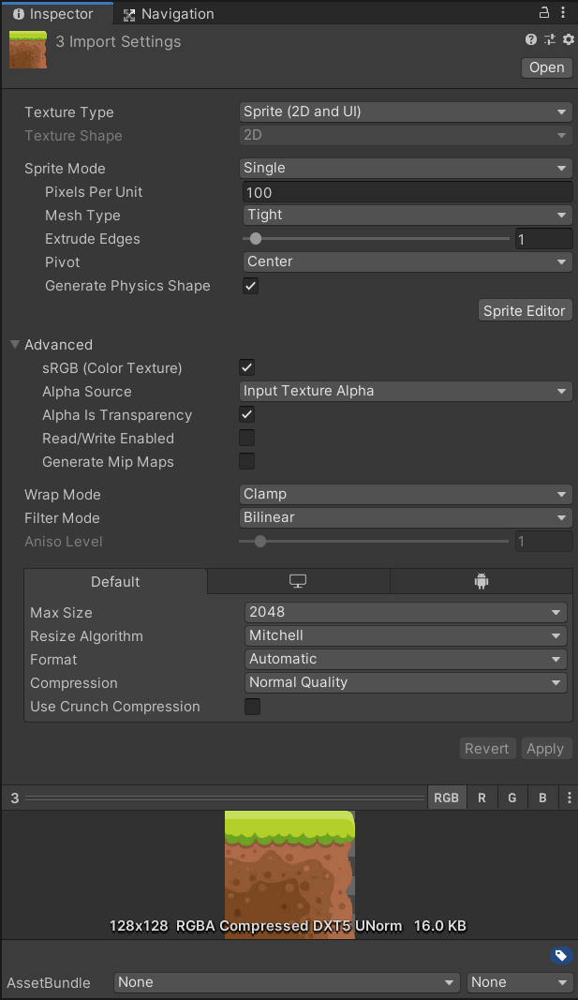

# Lab 6 - elementy gry 2D, część 1

> **Wymagania**  
> Na potrzeby laboratorium oraz zadań potrzebne będą dodatkowe pakiety:
> * 2D Sprite
> * 2D SpriteShape
> * 2D Animation
> * 2D Tilemap Editor  
> Upewnij się, że są zainstalowane lub zainstaluj brakujące.

Materiały zawarte w tym laboratorium są tylko częścią tego co można znaleść w oficjalnej dokumentacji dla projektów 2D w Unity. Aby zdobyć rozeznanie w szerszym aspekcie przeczytaj część znajdującą się pod adresem: https://docs.unity3d.com/Manual/Unity2D.html

## 1. **Import grafiki 2D do projektu Unity**

Przygotowanie grafiki i modeli dla gry wymaga zaplanowania sposobu ich wykorzystania w grze. Czy będzie to gra z grafiką typu 'pixel art', czy będziemy korzystać z grafiki w wysokiej rozdzielczości. To wymaga przygotowania obiektów w skali, tak aby zachować odpowiednie proporcje i jakość grafiki. Powinniśmy również w przypadku korzystania z 'kafelków' (ang. tiles) odpowiednio dopasować wielkość grafiki, co pozwoli na bardziej precyzyjne dopasowanie wielkości elementów do siatki dostępnej w Unity.

Pojedynczy plik graficzny możemy zaimportować bezpośrednio z widoku `Project` i wybierając z menu kontekstowego opcję `Import New Asset...`. Po zaimportowaniu pliku w oknie inspektora możemy zmienić ustawienia importu lub pozostawić je jako domyślne.

`Texture Type` określa typ grafiki, który chcemy dla importowanego obrazu wybrać. Wybór będzie miał wpływ na możliwość zdefiniowania dodatkowych parametrów i wykorzystanie w projekcie.

**Dostępne typy:**
* Default - domyślna wartość, która pozwala na określenie podstawowych parametrów obrazu oraz pozwala na określenie kształtu tekstury ([Texture Shape](https://docs.unity3d.com/Manual/class-TextureImporter.html#textureshape))
* Normal map - jest to rodzaj tekstury, który odpowiada za efekt gry światłem na jej powierzchni (tzw. bump mapping) umożliwiając powstanie złudzenia wypukłości tekstur unikając tworzenia faktycznych wypukłości, które są bardziej kosztowne obliczeniowo.
* Editor GUI and Legacy GUI - wykorzystywane do umieszczania tekstur na powierzchni obiektów GUI lub HUD
* Sprite (2D and UI) - typ wykorzystywany dla tzw. Sprite'ów, czyli grafiki najczęściej uzywanej w grach 2D
* Cursor - pozwala na wykorzystanie tekstury dla kursora, np. celownika
* Cookie - jest to specjalny rodzaj tekstur służący do generowania efektu cienia rzucanego przez obiekt znajdujący się między źródłem światła a powierzchnią, do której owo światło dociera. Więcej: [Cookies](https://docs.unity3d.com/Manual/Cookies.html)
* Lightmap - jest to tekstura, w której zastosowane są już niektóre efekty świetlne, zapisane na stałe, pozwalając uniknąć generowania tych efektów w czasie rzeczywistym, jeżeli dany element tego nie wymaga.
* Single Channel - rodzaj tekstury, gdzie możemy określić tylko jeden z kanałów (alfa lub red)

**`Sprite Mode`** pozwala na określenie czy mamy do czynienia z pojedynczym Sprite'em (`Single`) czy może ze zbiorem Sprite'ów (`Multiple`) umieszczonych w jednym pliku. Możemy również przyciąć istniejącą teksturę wybierając opcję `Polygon` i następnie w `Sprite Editor` zmieniając wyświetlany obszar poprzez zmianę kształtu z opcji `Sprite Custom Outline`.

**`Pixel Per Unit`** (PPU) to bardzo ważny parametr, którym określamy ile pikseli obrazu przypada na jedną jednostkę w środowisku Unity. Zaplanowanie użycia tego parametru przed przystąpieniem do prac nad grafiką jest zazwyczaj dobrym pomysłem. 

**`Mesh Type`** pozwala na określenie obszaru Sprite'u, `Full Rect` to określenie obszaru jako czworobok a `Tight` to automatyczne stworzenie kształtu bazując na przezroczystych pikselach, które znajdują się w obszarze obrazu. Zazwyczaj dopasowane do nieprzezroczystych pikseli obrazu. Dla obrazów mniejszych niż 32x32 piksele uzywany jest automatycznie `Full Rect` nawet jak wybrany został parametr `Tight`.

**`Extrude Edges`** określa w pikselach jaki obszar otaczający Sprite będzie wolny - zgodnie z opisem w dokumentacji. W rzeczywistości zmiana tych parametrów nie przynosi żadnych rezultatów.

**`Pivot`** pozwala na ustalenie punktu obrotu dla danego elementu.

**`Generate Physics Shape`** jeżeli nie został zdefiniowany niestandardowy kształt (`Custom Physics Shape`) Unity wygeneruje autoamtycznie kształ pokrywający się z krawędziami danego Sprite'u.

**`Remove Matte`** jest ustawienie stosowane do plików PSD (Photoshop), które używają przezroczystości. Poprawia wygląd krawędzi przylegających do przezroczystego obszaru.

**`Read/Write Enabled`** włączenie tej opcji umożliwia dostęp do danych tekstury z poziomu skryptów. 

**`Generate Mip Maps`** włączenie tej opcji przydaje się w przypadku gdy obraz będzie skalowany w widoku sceny do bardzo małych rozmiarów. Wygenerowane zostaną miniaturowe wersje tych obrazów.

**`Wrap Mode`** definiuje zachowanie obrazu kiedy używany jest jako kafelek ([więcej tu](https://docs.unity3d.com/Manual/class-TextureImporter.html#WrapMode) oraz [tu](https://docs.unity3d.com/ScriptReference/TextureWrapMode.html)).

**`Filter Mode`** zmienia zachowanie tekstury kiedy zostaje ona zmodyfikowana przez przekształcenia 3D. `Point` oznacza brak filtrowania (rozmycia) i stosowane jest do grafiki typu Pixel Perfect. `Bilinear` i `Trilinear` rozmywa obraz kiedy go przybliżamy.

**`Aniso level`** wpływa korzystnie na jakość wyświetlanego Sprite'a kiedy widok kamery jest dkierowany na niego pod kątem ostrym.

Ustawienia, które znajdują się na samym dole przedstawionego powyżej okna umożliwiają dostosowanie ustawień dla poszczególnych platform, na których gra zostanie uruchomiona. `Default` zawiera domyślne ustawienia a pozostałe zakładki dla wybranych platform docelowych.
Więcej szczegółów o możliwych ustawieniach dla wybranych parametrów znajdziesz pod linkiem: https://docs.unity3d.com/Manual/class-TextureImporter.html#platform

> Dodatkowe materiały:
> * https://learn.unity.com/tutorial/importing-2d-assets-into-unity-2019-3#5f7cfc5cedbc2a0022112cab

### **Sprite Editor**

**`Sprite Editor`** pozwala na edycję takich właściwości obrazu jak punkt obrotu, krawędzie dla skalowania typu 9-slice, niestandardowy kształt fizyczny (wykorzystywany ze zderzaczami oraz materiałami fizycznymi). To narzędzie pozwala również w trybie `Multiple` na pocięcie jednego pliku z wieloma Sprite'ami na oddzielne Sprite'y. Proces ten może być automatyczny, ręczny lub można spróbować pociąć plik automatycznie i wykonać poprawki w trybie ręcznym.

Sprite Editor zawiera również narzędzie **`Skinning Editor`** które pozwala tworzyć szkielety złożone z kości, które daje możliwość dodania animacji w sposób dużo bardziej efektywny i dynamiczny. 

**Wykonaj zadanie nr 0, 1 oraz 2.**

## 2. **Rigging - budowanie szkieletu.**  

Aby ułatwić sobie proces budowania szkieletu najwygodniej jest przygotować Sprite z postacią pocięty tak, że każda część ciała to oddzielny sprite. Jednak należy go zaimportować w trybie `Single`. Jeżeli będzie to pojedynczy Sprite, będziemy musieli włożyć więcej pracy w dostosowanie podziału kształtu oraz wag oddziaływania poszczególnych kości na otaczające ją 'ciało' postaci.

> Dodatkowe materiały do nauki:  
> * https://learn.unity.com/tutorial/rigging-a-sprite-with-the-2d-animation-package#
> * https://www.youtube.com/watch?v=EZtpACxCTEE
> * https://www.youtube.com/watch?v=vap04-Py9QM

**Wykonaj zadanie nr 3 oraz 4.**

## Zadania

**Zadanie 0**  
Jako, że kolejny lab będzie kontynuacją bieżącego, dobrym pomysłem wydaje się stworzenie nowego projektu 2D dla tego projektu. Tym razem nie jest konieczne umieszczanie całego projektu w repozytorium. W ostatnim zadaniu opisane są szczegóły dotyczące elementów do umieszczenia w repo.

**Zadanie 1**  
Zaimportuj [grafikę](assets/mountain_landscape.png) do projektu Unity i przy pomocy `Sprite Editor'a` potnij ją na oddzielne Sprite'y. Uwzględnij wykorzystanie minimum 3 Sprite'ów jako 9-slice'y. Dodatkowe wskazówki i przykłady znajdziesz pod adresem: https://docs.unity3d.com/Manual/9SliceSprites.html

**Zadanie 2**  
Przygotuj przykładową scenę wykorzystując assety ze zbioru dostępnego pod adresem https://opengameart.org/content/rpg-tiles-cobble-stone-paths-town-objects. Warto dodać nowe warstwy na scenie oraz przypisać elementy do odpowiednich warstw oraz ustalić kolejność renderowania obiektu w warstwie. Jeżeli masz problem z kolejnością wyświetlania elementów przeczytaj https://docs.unity3d.com/2022.3/Documentation/Manual/2DSorting.html

**Zadanie 3**  
Zaimportuj grafikę przedstawiającą [Trolla](assets/Troll2.png) i dodaj do niego szkielet bazując na przykładzie z labu oraz załączonych linkach z materiałami dodatkowymi. Pamiętaj o nazwaniu poszczególnych kości dla ułatwienia ich późniejszej identyfikacji. "Pocięty" troll znajduje się w folderze [assets/Troll2](assets/Troll2). Najwygodniej będzie zapisać wszystkie części w jednym pliku - można to zrobić przy pomocy programu Gimp.

**Zadanie 4**  
Dodaj szkielet na scenę, ułóż elementy w odpowiednim porządku i sprawdź czy kolejność kości jest poprawna. Dodaj komponent `Sprite Skin` i wksaż kość bazową.

Materiały użyte w laboratorium pochodzą z:
* https://opengameart.org/content/2d-lost-garden-zelda-style-tiles-resized-to-32x32-with-additions
* https://www.gameart2d.com/free-platformer-game-tileset.html
* https://craftpix.net/