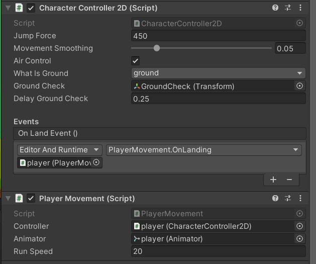
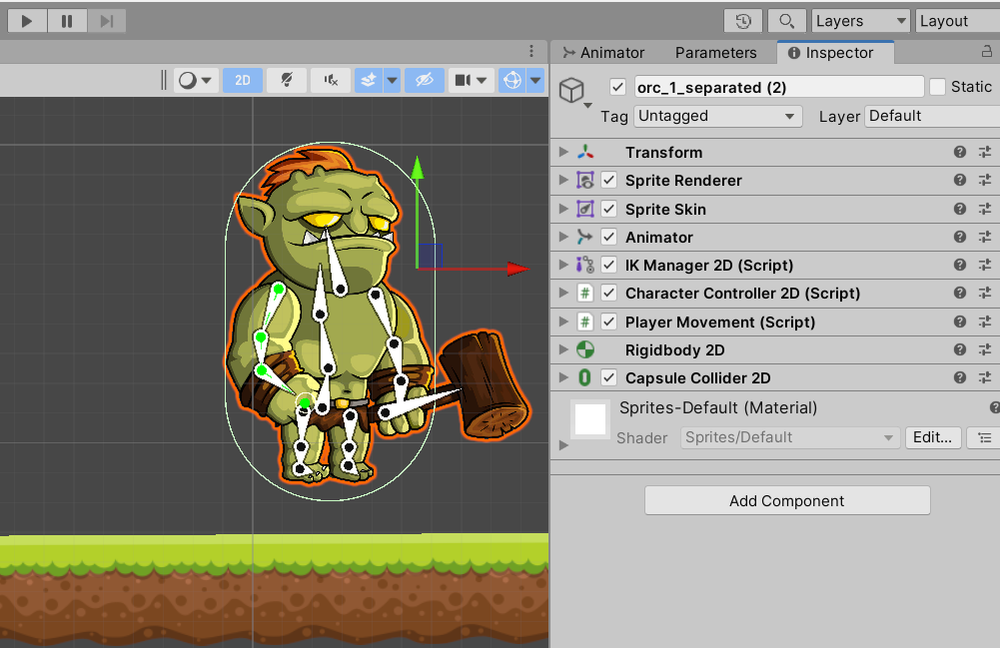
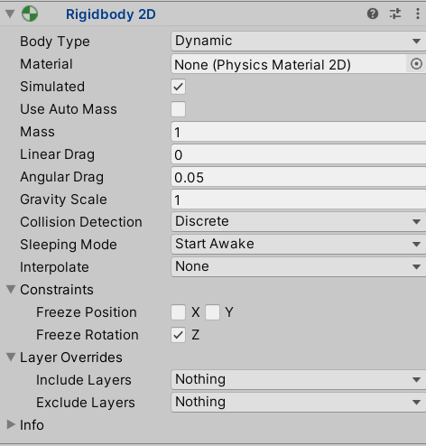
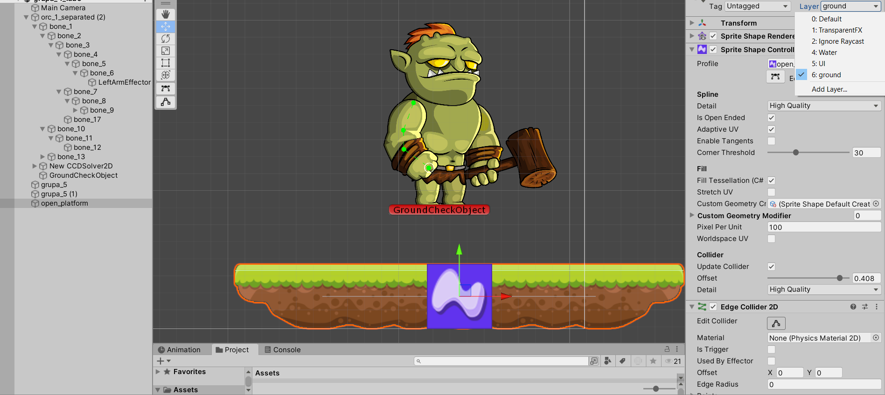

# Lab 7. Tworzenie gry 2D, część 2. 


## 1. Animacja postaci z wykorzystaniem szkieletu oraz komponentu IK (Inverse Kinematics).

> Tutoriale godne polecenia:
> * https://www.youtube.com/watch?v=eXIuizGzY2A
> * https://www.youtube.com/watch?v=Ed8CoET9b6U
> * https://www.youtube.com/watch?v=Htl7ysv10Qs

## 2. Sprite shape - efektywne budowanie gry platformowej 2D.

> Tutoriale:
> * https://docs.unity3d.com/Packages/com.unity.2d.spriteshape@3.0/manual/index.html
> * https://www.raywenderlich.com/3045258-introduction-to-unity-sprite-shapes
> * https://learn.unity.com/tutorial/working-with-spriteshape
> * https://blogs.unity3d.com/2018/09/20/intro-to-2d-world-building-with-sprite-shape/
> * https://www.youtube.com/watch?v=GSo_fU1JdfM


## 3. Maszyna stanów animacji - animation state machine.

Podstawy tworzenia animacji oraz obsługi maszyny stanów animacji zostaną zaprezentowane przez prowadzącego.

> Tutoriale:
> * https://www.youtube.com/watch?v=hkaysu1Z-N8


## 4. Dodajemy kilka gotowych elementów

Assety są dostępne w labie numer 6 - [freetilesets](../lab_06/assets/freetileset.zip).

Skrypty do poruszania postacią. Skrypty pochodzą ze zbiorów Brackey's, ale zostały zmodyfikowane.

**_Listing 1_**

```csharp
using UnityEngine;
using UnityEngine.Events;

public class CharacterController2D : MonoBehaviour
{
	[SerializeField] private float m_JumpForce = 350f;                          // Amount of force added when the player jumps.
	[Range(0, .3f)] [SerializeField] private float m_MovementSmoothing = .05f;  // How much to smooth out the movement
	[SerializeField] private bool m_AirControl = false;                         // Whether or not a player can steer while jumping;
	[SerializeField] private LayerMask m_WhatIsGround;                          // A mask determining what is ground to the character
	[SerializeField] private Transform m_GroundCheck;                           // A position marking where to check if the player is grounded.
	[SerializeField] private float m_delayGroundCheck = 0.25f;

	const float k_GroundedRadius = .2f; // Radius of the overlap circle to determine if grounded
	private bool m_Grounded;            // Whether or not the player is grounded.
	private Rigidbody2D m_Rigidbody2D;
	private bool m_FacingRight = true;  // For determining which way the player is currently facing.
	private Vector3 m_Velocity = Vector3.zero;
	private float timeBeforeGroundCheck = 0f;

	[Header("Events")]
	[Space]

	public UnityEvent OnLandEvent;

	[System.Serializable]
	public class BoolEvent : UnityEvent<bool> { }

	private void Awake()
	{
		m_Rigidbody2D = GetComponent<Rigidbody2D>();

		if (OnLandEvent == null)
			OnLandEvent = new UnityEvent();
	}
	
	private void Update()
	{
		if (!m_Grounded)
		{
			timeBeforeGroundCheck -= Time.deltaTime;
		}
	}
	
	private void FixedUpdate()
	{
		if (timeBeforeGroundCheck > 0f)
		{
			return;
		}
		bool wasGrounded = m_Grounded;
		m_Grounded = false;

		// The player is grounded if a circlecast to the groundcheck position hits anything designated as ground
		// This can be done using layers instead but Sample Assets will not overwrite your project settings.
		Collider2D[] colliders = Physics2D.OverlapCircleAll(m_GroundCheck.position, k_GroundedRadius, m_WhatIsGround);
		for (int i = 0; i < colliders.Length; i++)
		{
			if (colliders[i].gameObject != gameObject)
			{
				m_Grounded = true;
				if (!wasGrounded)
					OnLandEvent.Invoke();
			}
		}
	}

	public void Move(float move, bool jump)
	{
		//only control the player if grounded or airControl is turned on
		if (m_Grounded || m_AirControl)
		{
			// Move the character by finding the target velocity
			Vector3 targetVelocity = new Vector2(move * 10f, m_Rigidbody2D.velocity.y);
			// And then smoothing it out and applying it to the character
			m_Rigidbody2D.velocity = Vector3.SmoothDamp(m_Rigidbody2D.velocity, targetVelocity, ref m_Velocity, m_MovementSmoothing);

			// If the input is moving the player right and the player is facing left...
			if (move > 0 && !m_FacingRight)
			{
				// ... flip the player.
				Flip();
			}
			// Otherwise if the input is moving the player left and the player is facing right...
			else if (move < 0 && m_FacingRight)
			{
				// ... flip the player.
				Flip();
			}
		}
		// If the player should jump...
		if (m_Grounded && jump)
		{
			m_Rigidbody2D.AddForce(new Vector2(0f, m_JumpForce));
			m_Grounded = false;
			timeBeforeGroundCheck = m_delayGroundCheck;
		}
	}

	private void Flip()
	{
		// Switch the way the player is labelled as facing.
		m_FacingRight = !m_FacingRight;

		// Multiply the player's x local scale by -1.
		Vector3 theScale = transform.localScale;
		theScale.x *= -1;
		transform.localScale = theScale;
	}
}
```

**_Listing 2_**

```csharp

using UnityEngine.SceneManagement;
using UnityEngine;

public class PlayerMovement : MonoBehaviour
{
    public CharacterController2D controller;
    public Animator animator;
    public float runSpeed = 30f;
    bool jump = false;
    float horizontalMove = 0f;
   
    void Update()
    {
        
        horizontalMove = Input.GetAxisRaw("Horizontal") * runSpeed;
        animator.SetFloat("Speed", Mathf.Abs(horizontalMove));

        if (Input.GetButtonDown("Jump"))
        {
            jump = true;
            animator.SetBool("IsJumping", true);
        }
    }

    void FixedUpdate()
    {
        controller.Move(horizontalMove * Time.fixedDeltaTime, jump);
        jump = false;
    }

    public void OnLanding()
    {
        Debug.Log("OnLanding()");
        animator.SetBool("IsJumping", false);
    }
}

```

Aby sterowanie głównym bohaterem działało poprawnie trzeba jeszcze dodać w inspektorze zdarzenie dla skryptu `CharacterController2D` tak jak na poniższym zrzucie ekranu.



Zbiór komponentów dla głównego bohatera:



Ustawienia komponentu Rigidbody2D dla głównego bohatera:



Własność **What Is Ground** wskazuje na obiekt typu LayerMask, czyli warstwę, którą ustawimy jako warstawę zawierającą elementy podłoża naszego poziomu gry np. platformy. Na poniższym zrzucie ekranu zaprezentowano kilka kolejnych ustawień. W panelu **hierarchy** widać istniejący obiekt **GroundCheckObject**, który jest usytułowany w okolicach stóp głównego bohatera a promieniu 0.25 jednostki od tego punktu będą wykrywane kolizje (overlap) z dowolnym obiektem, który znajduje się na utworzonej warstwie o nazwie **ground** (widać po prawej stronie zrzutu w oknie **Inspector**).

Na zrzucie znajduje się również platforma stworzona za pomocą Sprite Shape Profile (Open shape), do której został dodany collider oraz została ona umieszczona właśnie na warstwie **ground**.




**Zadania**

1. Dodaj animację dla skoku, ataku oraz otrzymania obrażeń.
2. Dodaj odpowiednie parametry i przejścia w komponencie `Animator`.
3. Zbuduj przykładowy poziom wykorzystując udostępnione assety. Wykorzystaj element typu Sprite Shape. W miarę możliwości zorganizuj elementy poziomu w odpowiednich warstwach (również warstwach sortowania). Dodaj tagi dla gracza.